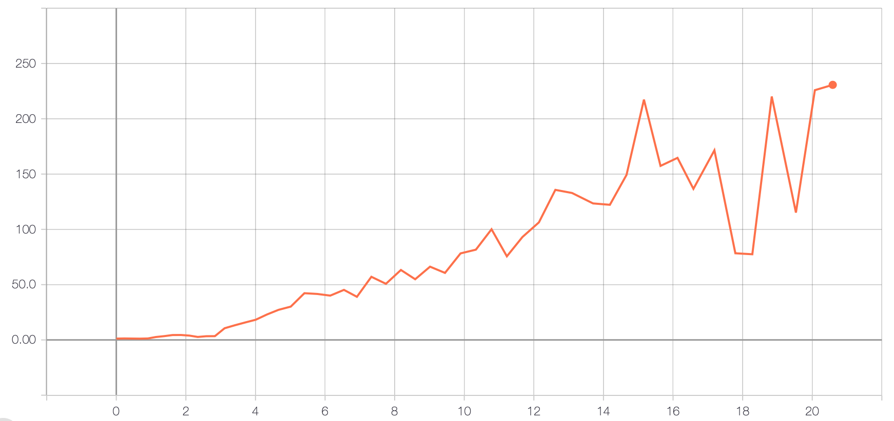

# Deep_Q_learning
Implementation of "Human-level control through deep reinforcement learning" (Mnih et al.): https://www.nature.com/articles/nature14236

# References
- Mnih et al.: https://www.nature.com/articles/nature14236
- van Hasselt et al.: http://www.aaai.org/ocs/index.php/AAAI/AAAI16/paper/download/12389/11847
- Seita: https://danieltakeshi.github.io/2016/11/25/frame-skipping-and-preprocessing-for-deep-q-networks-on-atari-2600-games/

# Score
This implementation reaches a score 230 after 20 hours of training.



# Installation
```
git clone https://github.com/antoinecollas/Deep_Q_learning
cd Deep_Q_learning
conda env update -f=environment_gpu.yml
conda activate dql
python setup.py install
```

# Training
```
python examples/train_atari.py -e Breakout
```

# Tensorboard
```
tensorboard --logdir=runs/
```